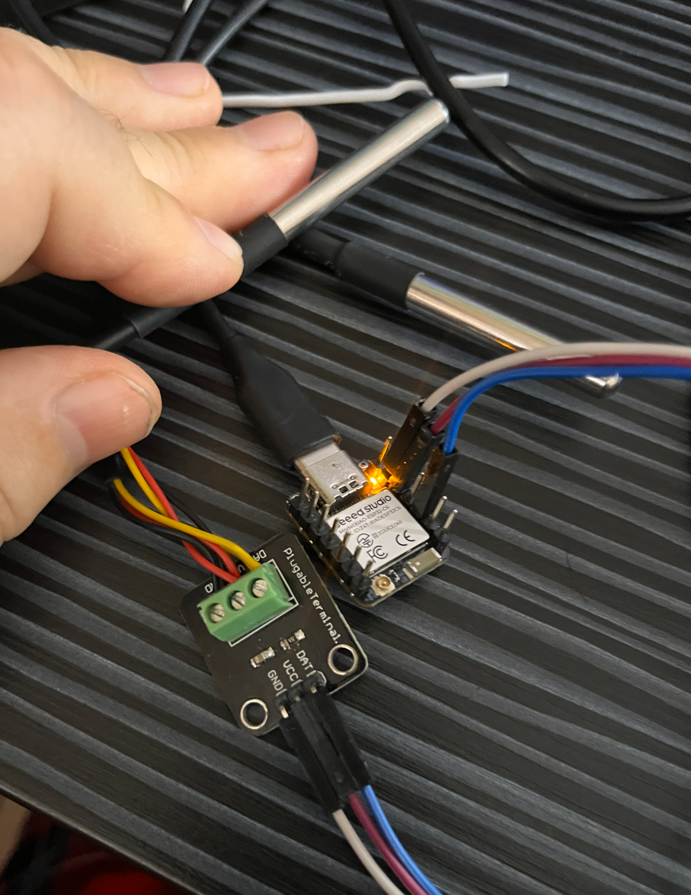

# ESP32-C6 Zigbee Dual Thermometer

Project for **Seeed Studio XIAO ESP32-C6** to measure temperature using two **DS18B20** sensors and transmit data via **Zigbee** to **Home Assistant** using **Zigbee2MQTT**.



## 📋 Features

- ✅ **Dual DS18B20 sensors** on a single OneWire bus (GPIO20)
- ✅ **Automatic detection** of DS18B20 sensors and their ROM addresses
- ✅ **Zigbee Router** functionality (strengthens Zigbee network)
- ✅ **Smart reporting** - sends data only when temperature changes by ≥1°C
- ✅ **Home Assistant integration** via Zigbee2MQTT
- ✅ **Two independent endpoints** in Zigbee (each sensor separately)
- ✅ **Complete ESP-IDF implementation** (C/C++)

> **Note:** This project was developed with the help of AI agents in VS Code (GitHub Copilot). 
Specifically, GPT-5.1-code was used for C coding and Claude Sonnet 4.5 for documentation and comments.

## 🔧 Hardware

### Required Components:
- 1× **Seeed Studio XIAO ESP32-C6** - [Amazon](https://a.co/d/5NcGTl1)
- 2× **DS18B20 digital temperature sensor** - [AliExpress module with resistor and capacitor](https://www.aliexpress.com/item/4000922310201.html)
- 1× **4.7kΩ resistor** (pull-up for OneWire) - *included in the DS18B20 module above*
- Wires and breadboard
- USB-C cable (with data wires)

### Wiring:

```
ESP32-C6 (XIAO)          DS18B20 #1          DS18B20 #2
─────────────────────────────────────────────────────────
3.3V ----------------+--- VDD -----------+--- VDD
                     |                   |
                   [4.7kΩ]               |
                     |                   |
GPIO20 --------------+--- DATA ----------+--- DATA
                     
GND -----------------+--- GND -----------+--- GND
```

**Pinout XIAO ESP32-C6:**
- **GPIO20** = D9 pin (MISO) on XIAO board
- **3.3V** = 3V3 pin
- **GND** = GND pin

## 📂 Project Structure

```
C6_Thermometer/
├── main/
│   ├── main.c              # Main program (Zigbee + DS18B20)
│   ├── onewire_bus.c       # OneWire driver
│   ├── onewire_bus.h
│   ├── ds18b20.c           # DS18B20 driver
│   ├── ds18b20.h
│   └── CMakeLists.txt      # Build configuration
├── CMakeLists.txt          # Root CMake
├── partitions.csv          # Partition table for Zigbee
├── sdkconfig.defaults      # ESP-IDF configuration
├── INSTALL.md              # Installation guide
├── DS18B20_ADDRESS_DETECTION.md  # Sensor address detection guide
├── ZIGBEE2MQTT_CONFIG.md   # Z2M configuration
└── README.md               # This file
```

## 🚀 Quick Start

### Option A: Flash Pre-compiled Firmware (No Development Environment Needed)

**Easiest method** - just flash and use:

1. Download the latest firmware from [GitHub Releases](https://github.com/rhlavienka/ESP32C6_Dual_Thermometer/releases/latest)
2. Follow **[FLASHING.md](FLASHING.md)** for detailed flashing instructions
3. Wire DS18B20 sensors according to the schema above
4. Flash using esptool or ESP Flash Download Tool
5. Configure Zigbee2MQTT (see [ZIGBEE2MQTT_CONFIG.md](ZIGBEE2MQTT_CONFIG.md))

### Option B: Build from Source (For Developers)

**Full development setup:**

#### 1. Development Environment Setup

Follow **[INSTALL.md](INSTALL.md)** for detailed installation instructions:
- ESP-IDF (v5.5.1)
- Visual Studio Code
- ESP-IDF VS Code extension

#### 2. Clone/Open Project

```powershell
# Open VS Code
# File → Open Folder → select C6_Thermometer folder
```

#### 3. Set Target

```powershell
# In VS Code: Ctrl+Shift+P
ESP-IDF: Set Espressif Device Target → esp32c6
```

#### 4. Connect Hardware

1. Wire DS18B20 sensors according to the schema above
2. Connect XIAO ESP32-C6 via USB-C to PC

#### 5. Build and Flash

```powershell
# In VS Code: Ctrl+E D
# Or:
idf.py build flash monitor
```

#### 6. Monitor Output

After flashing, open serial monitor (115200 baud) and you will see:

```
I (xxx) ZIGBEE_THERMO: ESP32-C6 Zigbee Thermometer Starting...
I (xxx) ZIGBEE_THERMO: OneWire bus initialized on GPIO20
I (xxx) ZIGBEE_THERMO: Scanning for DS18B20 sensors...
I (xxx) ZIGBEE_THERMO: Found device 1 - ROM: 28 AA BB CC DD EE FF 00
I (xxx) ZIGBEE_THERMO: Sensor 1 assigned
I (xxx) ZIGBEE_THERMO: Found device 2 - ROM: 28 11 22 33 44 55 66 77
I (xxx) ZIGBEE_THERMO: Sensor 2 assigned
I (xxx) ZIGBEE_THERMO: Scan complete. Found 2 DS18B20 sensor(s)
I (xxx) ZIGBEE_THERMO: Initialize Zigbee stack
I (xxx) ZIGBEE_THERMO: Start network steering
I (xxx) ZIGBEE_THERMO: Joined network successfully
I (xxx) DS18B20: Temperature: 23.50°C
```

## 🏠 Home Assistant Integration

### 1. Connect to Zigbee Network

1. Open **Zigbee2MQTT** web interface
2. Enable **"Permit Join"**
3. Restart ESP32-C6
4. Wait for automatic pairing

### 2. Configuration

Follow **[ZIGBEE2MQTT_CONFIG.md](ZIGBEE2MQTT_CONFIG.md)** for:
- Automatic device detection
- Custom converter (if needed)
- Home Assistant entities and automations

### 3. Result in Home Assistant

After successful pairing you will see:
- `sensor.esp32c6_thermometer_sensor1_temperature`
- `sensor.esp32c6_thermometer_sensor2_temperature`

## 📝 Important Information

### Zigbee Endpoints:
- **Endpoint 11** = Sensor 1 (first detected DS18B20)
- **Endpoint 12** = Sensor 2 (second detected DS18B20)

### Temperature Reporting:
- **Periodic measurement:** every 5 seconds
- **Send to Z2M:** only on change ≥ 1°C
- **Resolution:** 0.0625°C (12-bit ADC DS18B20)

### GPIO Pins:
- **GPIO20** = OneWire bus for DS18B20 (D9/MISO on XIAO)
- **GPIO14** = Antenna selection (LOW = internal, HIGH = external)
- **GPIO3** = Enable RF switch (must be LOW to use antennas)

## 🔍 DS18B20 Sensor Detection

If you need to find out the ROM addresses of your DS18B20 sensors, see:
**[DS18B20_ADDRESS_DETECTION.md](DS18B20_ADDRESS_DETECTION.md)**

The program automatically scans and displays found sensors at startup.

## ⚙️ Configuration

### Change OneWire GPIO:

In `main/main.c` file:
```c
#define ONEWIRE_GPIO GPIO_NUM_5  // Change to desired pin
```

### Change reporting threshold:

```c
#define TEMP_REPORT_THRESHOLD 1.0f  // Change in °C
```

### Change measurement period:

In `temperature_sensor_task()`:
```c
vTaskDelay(pdMS_TO_TICKS(5000));  // 5000 ms = 5 seconds
```

## 🐛 Troubleshooting

### Sensors not found:
- Check wiring (VDD, GND, DATA)
- Verify pull-up resistor 4.7kΩ
- Use shorter wires (max ~30m)
- Test sensors separately

### Zigbee not connecting:
- Enable "Permit Join" in Z2M
- Restart ESP32-C6
- Check Zigbee channel
- Verify logs in serial monitor

### Temperatures not updating:
- Check binding and reporting in Z2M
- Verify threshold (1°C)
- Monitor logs in serial monitor

Detailed troubleshooting can be found in the documentation.

## 📚 Documentation

### Basic Documentation:
- **[FLASHING.md](FLASHING.md)** - Flash pre-compiled firmware (no ESP-IDF needed)
- **[INSTALL.md](INSTALL.md)** - Detailed installation guide for development (ESP-IDF)
- **[WIRING.md](WIRING.md)** - Wiring schema and pinout
- **[DS18B20_ADDRESS_DETECTION.md](DS18B20_ADDRESS_DETECTION.md)** - Sensor detection
- **[ZIGBEE2MQTT_CONFIG.md](ZIGBEE2MQTT_CONFIG.md)** - Z2M configuration

### Advanced Documentation:
- **[HOME_ASSISTANT_EXAMPLES.md](HOME_ASSISTANT_EXAMPLES.md)** - Automation examples and Lovelace cards
- **[FAQ.md](FAQ.md)** - Frequently Asked Questions (50+ questions)
- **[CHANGELOG.md](CHANGELOG.md)** - Change history
- **[PROJECT_SUMMARY.md](PROJECT_SUMMARY.md)** - Project summary

## 🔗 Useful Links

- [ESP-IDF documentation](https://docs.espressif.com/projects/esp-idf/en/latest/)
- [ESP32-C6 datasheet](https://www.espressif.com/sites/default/files/documentation/esp32-c6_datasheet_en.pdf)
- [Seeed XIAO ESP32-C6 Wiki](https://wiki.seeedstudio.com/xiao_esp32c6_getting_started/)
- [DS18B20 datasheet](https://www.analog.com/media/en/technical-documentation/data-sheets/DS18B20.pdf)
- [Zigbee2MQTT documentation](https://www.zigbee2mqtt.io/)

## 📄 License

This project is freely usable for personal and commercial purposes.

## 🤝 Support

In case of problems:
1. Check documentation in this repository
2. Verify hardware wiring
3. Check logs in serial monitor
4. Verify software versions (ESP-IDF 5.5.1+)


---

**Created for:** Seeed Studio XIAO ESP32-C6  
**Framework:** ESP-IDF v5.5.1  
**Protocol:** Zigbee 3.0  
**Version:** 1.1.0  
**Date:** November 2025
